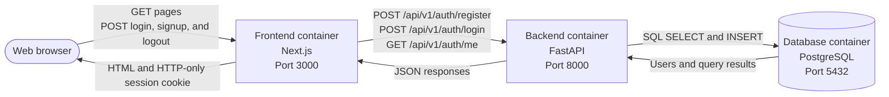

# Belskap architecture

Belskap runs as three containers: a Next.js frontend, a FastAPI backend, and a
PostgreSQL database.

The frontend serves the interface and manages the user's session cookie. It
sends registration, login, and current-user API requests to the backend. The
backend validates those requests, handles passwords and authentication tokens,
and reads or writes user records in PostgreSQL.

Docker Compose connects the containers on an internal network. Users open the
frontend at `localhost:3000`; the backend is also available at `localhost:8000`
for API access and interactive documentation.
